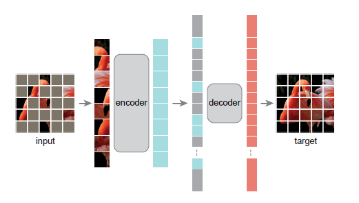
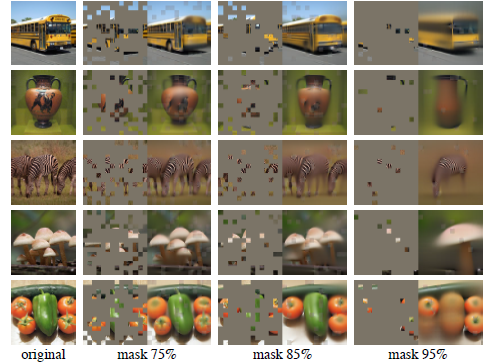
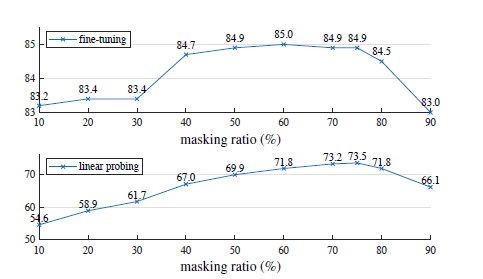
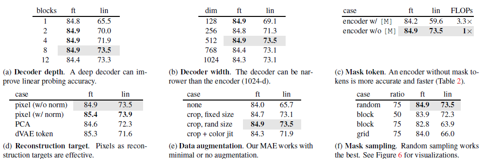
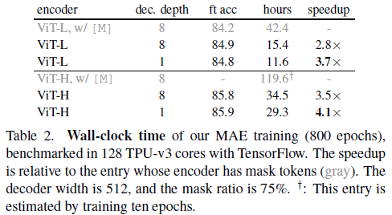
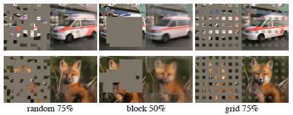

# Masked_Autoencoders_Are_Scalable_Vision_Learners

## Overview

1. This paper shows that MAE are scalable self-supervised for computer vision by masking random patches of the input image and reconstruct the missing pixels.
   - Develop an asymmetric encoder-decoder architecture. Encoder operates on the unmasked part of the image, decoder reconstruct the original image from the latent representation and mask tokens.
   - Mask 75% of the image randomly yields a non-trivial and meaningful self-supervisory task and accelerate training by 3 times or more. 
2. Same with ViT, MAE encoder embeds patches by a linear projection with added positional embeddings. The difference is that MAE encoder only applied it on un-masked patches.
3. MAE, a simple-supervised method based on autoencoder, achieves the same accuracy as other supervised algorithms on ImageNet. With MAE pre-training, they can train datahungry models like ViT-Large/-Huge on ImageNet-1K with improved generalization performance. With a vanilla ViT-Huge model, they achieve 87.8% accuracy when finetuned on ImageNet-1K.
4. MAE is a form of denoising autoencoding but different from the classical DAE(denoising autoencoder) in numerous ways. 

### MAE Structure

### Result

### Fine Tuning

## Discussion Topic 1
At the dicussion part, the author says: 'simple algorithms that scale well are the core of deep learning.' Does this algorithm really simple and scalable for us?

## Discussion Topic 2
what makes masked autoencoding different between vision and language?

## Discussion Topic 3
Why randomly mask token is more accurate than other method?

## Critical Analysis

At MAE decoder stage, the author mentioned that they add positional embedding to all tokens in this full set since the decoder has another series of transformer blocks. But, I am not sure if they still need to add the positional embedding for the latent representations(already added postional embedding) from encoder stage.

## Resource Link

Paper: https://arxiv.org/abs/2111.06377

## Code Demonstration

The code has not yet been made availalbe.

## Video Recording

https://www.youtube.com/watch?v=cIUtRNhY6Rw
